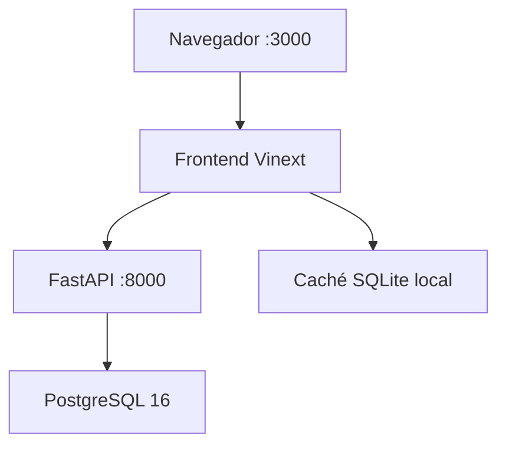

# Arquitectura del proyecto

## Superficies de ejecución

El repositorio mantiene dos superficies que comparten el frontend y la lógica estadística:

1. **Sites:** React/Vinext se construye como Cloudflare Worker. La caché y la configuración editorial se guardan en D1 mediante la vinculación `DB`.
2. **Docker local:** el frontend se ejecuta en el puerto 3000, FastAPI en el 8000 y PostgreSQL 16 en el 5432. Los servicios se conectan mediante la red `relatos_net`.

Actualizar la rama `version_python` no modifica el sitio publicado. Sites solo cambia cuando se guarda y despliega expresamente una nueva versión.

## Componentes

| Componente | Ubicación | Responsabilidad |
| --- | --- | --- |
| Interfaz | `app/` | Páginas, navegación, gráficos y estados de carga |
| API Vinext | `app/api/` | Datos estadísticos, CMS, SDMX y MCP |
| Dominio | `lib/` | Transformación, validación y modelos |
| Worker | `worker/index.ts` | Entrada compatible con Cloudflare |
| Persistencia Sites | `db/`, `drizzle/` | Esquema y migraciones D1 |
| Backend local | `backend/app/` | API REST FastAPI y acceso SQLAlchemy |
| Migraciones locales | `backend/migrations/` | Evolución del esquema PostgreSQL |
| Datos iniciales | `public/` | Cachés recuperables, planillas y activos |
| Automatización | `scripts/`, `.github/workflows/` | Extracción, actualización y controles |

## Flujo de datos estadísticos

1. La interfaz solicita una operación.
2. La ruta responde con la última revisión válida disponible.
3. Se verifica la firma de la fuente oficial.
4. Si la firma cambió, se descarga y transforma el archivo.
5. Se validan estructura, períodos, unidades e indicadores.
6. La revisión válida reemplaza la caché anterior.
7. Si la fuente falla, la revisión anterior permanece disponible.

Este diseño evita que una indisponibilidad temporal de `ine.gob.cl` deje la operación sin datos.

## Flujo Docker

El backend usa el host interno `db`, no `localhost`. El volumen `postgres_data` conserva PostgreSQL y `frontend_cache` conserva la caché del frontend. El esquema efectivo, sus relaciones lógicas y los comandos de inspección están documentados en [docs/SQLITE_CACHE.md](docs/SQLITE_CACHE.md).

## CMS, SDMX y MCP

- `/admin` administra secciones y configuración por operación.
- `/api/operation-config` entrega la configuración pública.
- `/api/sdmx/*` publica catálogo, metadatos y observaciones.
- `/api/mcp` expone herramientas estadísticas para clientes compatibles.

## Límites

- Los transformadores dependen de la estructura de archivos oficiales.
- D1 y PostgreSQL son implementaciones distintas; no existe sincronización automática entre ellas.
- Los archivos de `public/` son datos iniciales, no la fuente estadística maestra.
- Incorporar una operación requiere revisión metodológica, editorial y técnica.
