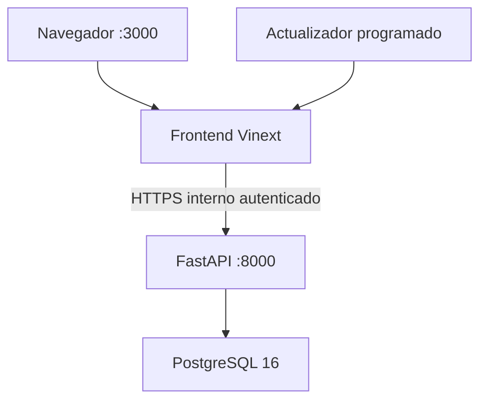

# Arquitectura del proyecto

## Superficie de ejecución

`version_postgresql` corresponde al despliegue Docker institucional. El frontend se ejecuta en el puerto 3000, FastAPI en el 8000 y PostgreSQL 16 en el 5432. Los servicios se conectan mediante la red `relatos_net`. Esta rama no usa Sites, D1 ni SQLite.

## Componentes

| Componente | Ubicación | Responsabilidad |
| --- | --- | --- |
| Interfaz | `app/` | Páginas, navegación, gráficos y estados de carga |
| API Vinext | `app/api/` | Datos estadísticos, CMS, SDMX y MCP |
| Dominio | `lib/` | Transformación, validación y modelos |
| Worker | `worker/index.ts` | Entrada compatible con Cloudflare |
| Acceso a datos | `backend/app/` | API REST, gateway interno y SQLAlchemy |
| Migraciones | `backend/migrations/` | Evolución exclusiva del esquema PostgreSQL |
| Datos iniciales | `public/` | Cachés recuperables, planillas y activos |
| Automatización | `scripts/`, `.github/workflows/` | Extracción, actualización y controles |

## Flujo de datos estadísticos

1. La interfaz solicita una operación.
2. La ruta responde con la última revisión válida disponible.
3. Se verifica la firma de la fuente oficial.
4. Si la firma cambió, se descarga y transforma el archivo.
5. Se validan estructura, períodos, unidades e indicadores.
6. La revisión válida reemplaza la caché anterior.
7. Si la fuente falla, la revisión anterior permanece disponible.

Este diseño evita que una indisponibilidad temporal de `ine.gob.cl` deje la operación sin datos.

## Flujo Docker

El backend usa el host interno `db`, no `localhost`. El volumen `postgres_data` conserva toda la información. Vinext usa `lib/postgres-d1.ts` solo como adaptador de compatibilidad de sus rutas: no ejecuta conexiones directas y envía consultas estáticas al gateway autenticado de FastAPI. El esquema está documentado en [docs/POSTGRESQL_DATABASE.md](docs/POSTGRESQL_DATABASE.md).

## CMS, SDMX y MCP

- `/admin` administra secciones y configuración por operación.
- `/api/operation-config` entrega la configuración pública.
- `/api/sdmx/*` publica catálogo, metadatos y observaciones.
- `/api/mcp` expone herramientas estadísticas para clientes compatibles.

## Límites

- Los transformadores dependen de la estructura de archivos oficiales.
- El endpoint interno de base de datos no debe publicarse mediante el proxy institucional.
- Los archivos de `public/` son datos iniciales, no la fuente estadística maestra.
- Incorporar una operación requiere revisión metodológica, editorial y técnica.
