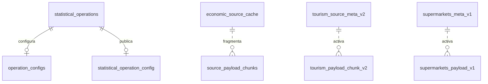

# Base de datos PostgreSQL institucional

## Alcance

`version_postgresql` usa PostgreSQL 16 como única persistencia. Vinext no abre
conexiones de base de datos: las rutas del frontend usan un adaptador HTTP
interno y autenticado; FastAPI valida las consultas estáticas y las ejecuta en
PostgreSQL. Alembic es el único mecanismo autorizado para modificar el esquema.

La base conserva el catálogo, configuración editorial, cachés estadísticas,
metadata de fuentes y contenidos fragmentados. Los archivos oficiales de
`ine.gob.cl` siguen siendo las fuentes primarias.

## Esquema lógico



Las líneas discontinuas son relaciones administradas por la aplicación. No se
declaran como claves foráneas porque las rutas escriben fragmentos antes de
activar la fila de metadata, lo que permite publicar una revisión completa de
forma segura.

## Tablas de catálogo

### `statistical_operations`

| Columna | Tipo | Restricción | Uso |
| --- | --- | --- | --- |
| `operation` | varchar(80) | PK | Identificador estable. |
| `label` | varchar(200) | NOT NULL | Nombre visible. |
| `topic` | varchar(160) | NOT NULL, índice | Materia estadística. |
| `description` | text | nullable | Descripción editorial. |
| `is_active` | boolean | NOT NULL | Inclusión en el catálogo. |
| `created_at` | timestamptz | NOT NULL | Creación del registro. |
| `updated_at` | timestamptz | NOT NULL | Última modificación. |

### `operation_configs`

Configuración normalizada del backend. `operation` es PK y FK hacia
`statistical_operations`, con eliminación en cascada. Los campos `analysis`,
`publications`, `documentation`, `databases` y `resources` son booleanos. Se
completa con `updated_at` y `updated_by`.

### `statistical_operation_config`

Compatibilidad editorial de las rutas Vinext. `operation` es PK y FK hacia
`statistical_operations`. Conserva `label`; los estados de las cinco secciones
se almacenan como `on` u `off`; incluye `updated_at` y `updated_by`.

## Cachés estadísticas

### `economic_source_cache`

| Columna | Tipo | Restricción | Uso |
| --- | --- | --- | --- |
| `kind` | text | PK | Operación o familia de datos. |
| `source_url` | text | NOT NULL | URL o lista serializada de fuentes. |
| `source_last_modified` | text | nullable | Fecha o firma informada por la fuente. |
| `source_etag` | text | nullable | ETag o firma auxiliar. |
| `source_size` | text | nullable | Tamaño informado. |
| `source_hash` | text | nullable | SHA calculado cuando corresponde. |
| `payload_json` | text | NOT NULL | Resultado validado o manifiesto de fragmentos. |
| `checked_at` | text | NOT NULL, índice | Última verificación, ISO 8601. |
| `updated_at` | text | NOT NULL | Última revisión válida, ISO 8601. |

La usan ENE, informalidad, IPC, IPP, estadísticas vitales, ENUSC, estadísticas
policiales, energía, industria, permisos y comercio.

### `source_payload_chunks`

Fragmenta cargas grandes como ENUSC. Su PK compuesta es `kind`, `revision` y
`chunk_index`; `payload_text` contiene cada fragmento. La relación con
`economic_source_cache.kind` es lógica.

### Turismo

`tourism_source_meta_v2` guarda `id` (PK), firmas de fuente, `checked_at`,
`updated_at` y el `cache_key` activo. `tourism_payload_chunk_v2` tiene PK
compuesta por `cache_key` y `sheet`, más `payload_json`.

### Supermercados

`supermarkets_meta_v1` guarda `id` (PK), `etag`, `last_modified`, `size`,
`cache_key`, `checked_at` y `updated_at`. `supermarkets_payload_v1` tiene PK
compuesta por `cache_key` y `part`, más el `payload` JSON serializado.

### `operation_cache_updates`

Resumen para ordenar el home. Contiene `operation` (PK), `cache_updated_at`,
`source_last_modified` y `checked_at`. Se alimenta desde las cachés económica,
de turismo y de supermercados.

### `catalog_publications_v1`

Caché del catálogo de publicaciones: `id` (PK), `payload` y `checked_at`.

### `source_cache`

Modelo normalizado inicial de FastAPI. Contiene metadata y un `payload` JSONB
por operación. Se conserva por compatibilidad con los endpoints públicos
`/api/v1/cache/{operation}`; las rutas estadísticas actuales usan las tablas
especializadas anteriores.

## Fechas

- `checked_at`: momento de la última comprobación, hubiera o no cambios.
- `updated_at`: momento de almacenamiento de la última revisión válida.
- `source_last_modified`: metadata recibida desde la fuente; no se interpreta
  como fecha si contiene un hash u otra firma.
- `revision` y `cache_key`: identificadores internos de una versión.

## Migraciones

Las migraciones están en `backend/migrations/versions/`:

- `0001_initial_schema.py`: catálogo, configuración y modelo normalizado.
- `0002_unified_postgresql_cache.py`: cachés antes alojadas en SQLite/D1.

El backend ejecuta `alembic upgrade head` antes de iniciar Uvicorn. No deben
crearse tablas manualmente ni mediante las rutas web.

Comandos de control:

```powershell
docker compose exec backend alembic current
docker compose exec backend alembic heads
docker compose exec backend alembic history
```

## Inspección

```powershell
docker compose exec db psql -U relatos -d relatos -c "\dt"
docker compose exec db psql -U relatos -d relatos -c "\d+ economic_source_cache"
docker compose exec db psql -U relatos -d relatos -c "SELECT kind, checked_at, updated_at FROM economic_source_cache ORDER BY checked_at DESC;"
```

Use los valores reales de `POSTGRES_USER` y `POSTGRES_DB` cuando sean distintos.

## Respaldo y restauración

Respaldo lógico comprimido:

```powershell
docker compose exec -T db pg_dump -U relatos -d relatos -Fc > relatos.dump
```

Restauración sobre una base vacía o controlada por T.I.:

```powershell
Get-Content relatos.dump -AsByteStream | docker compose exec -T db pg_restore -U relatos -d relatos --clean --if-exists
```

T.I. debe complementar este mecanismo con respaldos del volumen, cifrado,
retención, pruebas periódicas de restauración y monitoreo de espacio.

## Retención y consistencia

Las rutas validan una revisión antes de actualizar la metadata activa. Turismo,
supermercados y ENUSC eliminan revisiones anteriores después de activar la
nueva. Si una fuente falla, la última revisión válida permanece disponible.
Las modificaciones futuras deben incorporar una migración Alembic, pruebas de
base vacía y de actualización sobre una base existente, y una actualización de
este documento.
