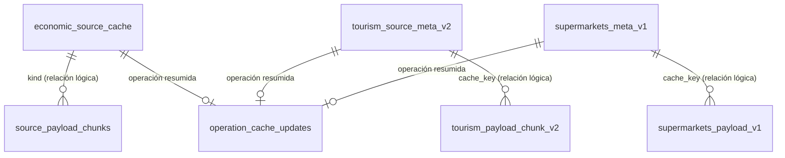

# Base SQLite de caché local

## Propósito y alcance

La rama `version_python` usa SQLite para reproducir localmente la interfaz D1
del sitio publicado. Esta base conserva las últimas respuestas estadísticas
válidas, la metadata de sus fuentes y parte de la configuración editorial. No
reemplaza PostgreSQL: FastAPI usa PostgreSQL y el frontend Vinext usa SQLite.

En Docker, el archivo se encuentra en:

```text
/var/lib/relatos-cache/cache.sqlite
```

El volumen `frontend_cache` conserva el archivo cuando los contenedores se
reinician o se recrean. La variable `LOCAL_D1_PATH` permite cambiar la ruta.

## Implementación

- `lib/local-d1.ts` adapta `node:sqlite` a los métodos `prepare`, `bind`, `run`,
  `first` y `all` usados por D1.
- `db/schema.ts` contiene las tablas declaradas con Drizzle.
- `drizzle/0000_mean_hedge_knight.sql` es la migración inicial.
- Algunas rutas de `app/api/` crean tablas bajo demanda con
  `CREATE TABLE IF NOT EXISTS`. Por esto, la migración inicial no representa
  por sí sola todo el esquema efectivo.
- La conexión configura `busy_timeout = 5000` y `journal_mode = WAL`.

## Modelo lógico



SQLite no declara claves foráneas para estas asociaciones. Las rutas API
mantienen la coherencia al escribir primero una revisión completa, actualizar
su fila de metadata y eliminar después las revisiones anteriores.

## Diccionario de tablas

### `economic_source_cache`

Caché general usada por ENE, informalidad, IPC, IPP, estadísticas vitales,
ENUSC, estadísticas policiales y las operaciones atendidas por
`/api/economic-data`.

| Columna | Tipo | Restricción | Descripción |
| --- | --- | --- | --- |
| `kind` | TEXT | PK, NOT NULL | Identificador técnico de la operación. |
| `source_url` | TEXT | NOT NULL | URL del archivo oficial consultado. |
| `source_last_modified` | TEXT | Nullable | Valor `Last-Modified` o fecha oficial verificable. |
| `source_etag` | TEXT | Nullable | ETag, hash u otra firma usada para detectar cambios. |
| `source_size` | TEXT | Nullable | Tamaño informado por la fuente. |
| `payload_json` | TEXT | NOT NULL | Respuesta transformada serializada como JSON. Puede actuar como manifiesto cuando el contenido se divide en fragmentos. |
| `checked_at` | TEXT | NOT NULL | Fecha y hora ISO 8601 de la última comprobación. |
| `updated_at` | TEXT | NOT NULL | Fecha y hora ISO 8601 de la última revisión válida almacenada. |

### `source_payload_chunks`

Fragmentos de cargas grandes. Actualmente la ruta ENUSC usa esta tabla para
evitar almacenar todo el resultado en una única celda.

| Columna | Tipo | Restricción | Descripción |
| --- | --- | --- | --- |
| `kind` | TEXT | PK compuesta, NOT NULL | Identificador de la operación. |
| `revision` | TEXT | PK compuesta, NOT NULL | Identificador de la revisión almacenada. |
| `chunk_index` | INTEGER | PK compuesta, NOT NULL | Posición del fragmento dentro de la revisión. |
| `payload_text` | TEXT | NOT NULL | Fragmento de la representación serializada. |

Relación lógica: `source_payload_chunks.kind` corresponde a
`economic_source_cache.kind`. `revision` identifica la versión referenciada por
el manifiesto guardado en `payload_json`.

### `tourism_source_meta_v2`

Metadata de la caché de turismo.

| Columna | Tipo | Restricción | Descripción |
| --- | --- | --- | --- |
| `id` | TEXT | PK | Identificador fijo de la fuente. |
| `source_last_modified` | TEXT | Nullable | Fecha informada por la fuente. |
| `source_etag` | TEXT | Nullable | Firma usada para detectar cambios. |
| `source_size` | TEXT | Nullable | Tamaño informado por la fuente. |
| `checked_at` | TEXT | NOT NULL | Última comprobación de la fuente. |
| `updated_at` | TEXT | NOT NULL | Última actualización válida. |
| `cache_key` | TEXT | NOT NULL | Revisión activa de los fragmentos de turismo. |

### `tourism_payload_chunk_v2`

Contenido de turismo separado por hoja de origen.

| Columna | Tipo | Restricción | Descripción |
| --- | --- | --- | --- |
| `cache_key` | TEXT | PK compuesta, NOT NULL | Revisión de la caché. |
| `sheet` | TEXT | PK compuesta, NOT NULL | Hoja o sección almacenada. |
| `payload_json` | TEXT | NOT NULL | Contenido transformado en JSON. |

Relación lógica: `cache_key` corresponde a
`tourism_source_meta_v2.cache_key`.

### `supermarkets_meta_v1`

Metadata de la caché de supermercados.

| Columna | Tipo | Restricción | Descripción |
| --- | --- | --- | --- |
| `id` | TEXT | PK | Identificador fijo `supermarkets`. |
| `etag` | TEXT | Nullable | Hash calculado sobre el archivo descargado. |
| `last_modified` | TEXT | Nullable | Fecha informada por la fuente. |
| `size` | TEXT | Nullable | Tamaño informado por la fuente. |
| `cache_key` | TEXT | Nullable | Revisión activa de las partes almacenadas. |
| `checked_at` | TEXT | Nullable | Última comprobación. |
| `updated_at` | TEXT | Nullable | Última actualización válida. |

### `supermarkets_payload_v1`

Contenido de supermercados dividido en metadata, índices y matrices.

| Columna | Tipo | Restricción | Descripción |
| --- | --- | --- | --- |
| `cache_key` | TEXT | PK compuesta, Nullable | Revisión de la caché. |
| `part` | TEXT | PK compuesta, Nullable | Nombre de la parte: `meta`, `index:*` o `matrix:*`. |
| `payload` | TEXT | Nullable | Contenido serializado como JSON. |

Relación lógica: `cache_key` corresponde a
`supermarkets_meta_v1.cache_key`.

### `operation_cache_updates`

Resumen usado para ordenar las publicaciones del home por la fecha oficial
disponible y por la actualización de su caché.

| Columna | Tipo | Restricción | Descripción |
| --- | --- | --- | --- |
| `operation` | TEXT | PK | Identificador de la operación. |
| `cache_updated_at` | TEXT | Nullable | Fecha de actualización de la revisión válida. |
| `source_last_modified` | TEXT | Nullable | Fecha o metadata temporal de la fuente. |
| `checked_at` | TEXT | NOT NULL | Última comprobación incorporada al resumen. |

La ruta `/api/catalog-latest` consolida esta tabla desde
`economic_source_cache`, `tourism_source_meta_v2` y `supermarkets_meta_v1`.

### `catalog_publications_v1`

Caché del catálogo de publicaciones consultado por el sitio.

| Columna | Tipo | Restricción | Descripción |
| --- | --- | --- | --- |
| `id` | TEXT | PK | Identificador de la entrada almacenada. |
| `payload` | TEXT | NOT NULL | Catálogo serializado. |
| `checked_at` | TEXT | NOT NULL | Fecha y hora de comprobación. |

### `statistical_operation_config`

Configuración editorial de las secciones visibles para cada operación.

| Columna | Tipo | Restricción | Descripción |
| --- | --- | --- | --- |
| `operation` | TEXT | PK | Identificador de la operación. |
| `label` | TEXT | NOT NULL | Etiqueta visible. |
| `analysis` | TEXT | NOT NULL, default `on` | Visibilidad de análisis. |
| `publications` | TEXT | NOT NULL, default `off` | Visibilidad de publicaciones. |
| `documentation` | TEXT | NOT NULL, default `off` | Visibilidad de documentación. |
| `databases` | TEXT | NOT NULL, default `off` | Visibilidad de bases de datos. |
| `resources` | TEXT | NOT NULL, default `off` | Visibilidad de recursos. |
| `updated_at` | TEXT | NOT NULL | Fecha y hora de modificación. |
| `updated_by` | TEXT | NOT NULL | Identificador del responsable del cambio. |

## Fechas y metadatos de actualización

Las fechas se almacenan como texto ISO 8601. Sus significados son distintos:

- `checked_at`: momento en que se revisó la fuente, aunque no hubiera cambios.
- `updated_at`: momento en que se guardó una nueva revisión válida.
- `source_last_modified`: metadata de la fuente; solo debe tratarse como fecha
  cuando su contenido sea una fecha válida.
- `cache_key` o `revision`: identificador interno de una versión del contenido.

El daemon `scripts/refresh-public-cache.mjs` llama las rutas con `refresh=1`.
En Docker se ejecuta al iniciar y, de lunes a viernes, cada cinco minutos entre
las 08:01 y las 10:01 según `America/Santiago`.

## Consistencia y retención

1. La ruta obtiene la última revisión válida.
2. Comprueba la fuente oficial mediante ETag, hash, `Last-Modified` o tamaño,
   según la disponibilidad de la fuente.
3. Si no hay cambios, actualiza `checked_at` y conserva el contenido.
4. Si hay cambios, transforma y valida el archivo antes de publicar la nueva
   revisión.
5. En las tablas fragmentadas, actualiza la fila de metadata después de escribir
   todas las partes y elimina las revisiones anteriores al final.
6. Si la descarga o la validación falla, conserva la revisión válida anterior.

No existe sincronización automática entre esta base SQLite, PostgreSQL y D1.
SQLite es la persistencia local de Docker; D1 es la persistencia del sitio
publicado; PostgreSQL pertenece a la API FastAPI.

## Inspección de la base activa

### Listar tablas y sentencias de creación

Desde la raíz del repositorio:

```powershell
docker compose exec frontend node -e 'const {DatabaseSync}=require("node:sqlite"); const db=new DatabaseSync("/var/lib/relatos-cache/cache.sqlite"); console.log(JSON.stringify(db.prepare("SELECT name, sql FROM sqlite_master WHERE type=''table'' AND name NOT LIKE ''sqlite_%'' ORDER BY name").all(), null, 2))'
```

### Consultar la estructura de una tabla

```powershell
docker compose exec frontend node -e 'const {DatabaseSync}=require("node:sqlite"); const db=new DatabaseSync("/var/lib/relatos-cache/cache.sqlite"); console.log(db.prepare("PRAGMA table_info(''economic_source_cache'')").all())'
```

### Consultar las últimas comprobaciones

```powershell
docker compose exec frontend node -e 'const {DatabaseSync}=require("node:sqlite"); const db=new DatabaseSync("/var/lib/relatos-cache/cache.sqlite"); console.table(db.prepare("SELECT kind, checked_at, updated_at, source_last_modified FROM economic_source_cache ORDER BY checked_at DESC").all())'
```

### Verificar el archivo persistente

```powershell
docker compose exec frontend node -e 'const fs=require("fs"); const p="/var/lib/relatos-cache/cache.sqlite"; const s=fs.statSync(p); console.log({archivo:p, bytes:s.size, modificado:s.mtime.toISOString()})'
```

## Evolución del esquema

Cuando se agregue o modifique una tabla:

1. actualizar `db/schema.ts`;
2. generar y versionar la migración correspondiente en `drizzle/`;
3. actualizar este diccionario;
4. mantener `CREATE TABLE IF NOT EXISTS` compatible con bases ya creadas;
5. probar tanto una base vacía como un volumen existente;
6. no borrar el volumen `frontend_cache` como mecanismo normal de migración.
